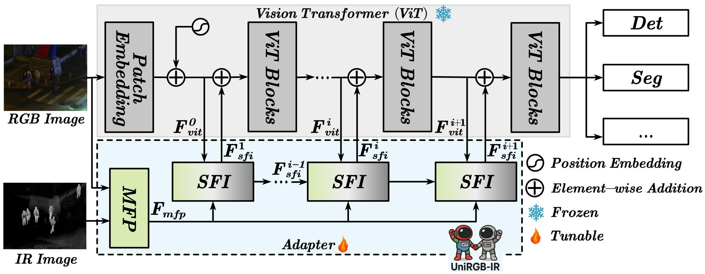

<div align="center">
    
</div>

# UniRGB-IR: A Unified Framework for RGB-Infrared Semantic Tasks via Adapter Tuning

<div align="center">

[](https://arxiv.org/abs/2404.17360)&nbsp;[](https://huggingface.co/tsuipo99/UniRGB-IR/tree/main)

</div>

## Introduction:

<div align="center">
    
</div>

Semantic analysis on visible (RGB) and infrared (IR) images has gained attention for its ability to be more accurate and robust under low-illumination and complex weather conditions. Due to the lack of pre-trained foundation models on the large-scale infrared image datasets, existing methods prefer to design task-specific frameworks and directly fine-tune them with pre-trained foundation models on their RGB-IR semantic relevance datasets, which results in poor scalability and limited generalization. In this work, we propose a general and efficient framework called UniRGB-IR to unify RGB-IR semantic tasks, in which a novel adapter is developed to efficiently introduce richer RGB-IR features into the pre-trained RGB-based foundation model. Specifically, our framework consists of a RGB-based foundation model, a Multi-modal Feature Pool (MFP) module and a Supplementary Feature Injector (SFI) module. The MFP and SFI modules cooperate with each other as an adapter to effectively complement the RGB-based features with the rich RGB-IR features. During training process, we freeze the entire foundation model to inherit prior knowledge and only optimize the proposed adapter. Furthermore, to verify the effectiveness of our framework, we utilize the vanilla vision transformer (ViT-Base) as the pre-trained foundation model to perform extensive experiments. Experimental results on various RGB-IR downstream tasks demonstrate that our method can achieve state-of-the-art performance.

## Installation

1. Create and activate the conda environment:
```bash
conda env create -f environment.yml
```

2. Install detection package:
```bash
cd detection/
pip install -e -v .
```

3. Install segmentation package:
```bash
cd segmentation/
pip install -e -v .
```

## Data Preparation

### Object Detection
FLIR, KAIST, and LLVIP all need to be reformatted. Taking FLIR as an example, the directory structure should be:
```
FLIR_align/
├── train/
├── test/
├── Annotation_train.json
├── Annotation_test.json
```

Then, replace `/path/to/Datasets/` in the configuration file with the parent path of the local `FLIR_align/`.

### Semantic Segmentation
Semantic Segmentation
Both MFNet and PST900 need to be formatted according to the [mmsegmentation](https://mmsegmentation.readthedocs.io/en/latest/user_guides/2_dataset_prepare.html) format. Taking MFNet as an example, the directory structure should be:
```
mfnet_mmseg/
├── annotations/
│   ├── train/
│   └── val/
├── images/
│   ├── train/
│   └── val/
```

Then, replace `/path/to/Datasets/` in the configuration file with the parent path of the local `mfnet_mmseg/`.

### Salient Object Detection
All datasets in the VT series need to be reformatted. Using VT5000 as an example, the directory structure should be:
```
VT5000/
├── Train/
│   ├── RGB/
│   ├── T/
│   └── GT/
├── Test/
│   ├── RGB/
│   ├── T/
│   └── GT/
```

Then, replace `/path/to/Datasets/` in the configuration file with the parent path of the local `VT5000/`.

You could download the salient maps for the salient object detection tasks of UniRGB-IR through the following links: [Google Drive](https://drive.google.com/file/d/1eP0JSmQbmJqMw4oPrj6EFBuGWjDpPnCO/view?usp=sharing)、[Baidu Netdisk](https://pan.baidu.com/s/1nZWgFQqebkPA0ka0OppcVg?pwd=4242).

## Fetching the Pre-trained Weight

Visit the [ViTDet page in Detectron2](https://github.com/facebookresearch/detectron2/tree/main/projects/ViTDet), download the [ViT-Base model weight](https://dl.fbaipublicfiles.com/detectron2/ViTDet/LVIS/cascade_mask_rcnn_vitdet_b/329226874/model_final_df306f.pkl), convert it to the OpenMMLab weight format.

Then, you can replace the `/path/to/vitb_coco_IN1k_mae_coco_cascade-mask-rcnn_224x224_withClsToken_noRel.pth` in the configuration file with the local path of the converted weight.

Weights of UniRGB-IR are released on [Hugging face](https://huggingface.co/tsuipo99/UniRGB-IR/tree/main).

## Training

### Object Detection
```bash
cd detection/
sh scripts/train_od.sh
```

### Salient Object Detection
```bash
cd segmentation/
sh scripts/train_sod.sh
```

### Semantic Segmentation
```bash
cd segmentation/
sh scripts/train_seg.sh
```

## TODO

- [x] Release the core code.
- [x] Release pre-trained weights for OD tasks.
- [ ] Release pre-trained weights for SS tasks.
- [ ] Release pre-trained weights for SOD tasks.

## Citation

If you find this code useful for your research, please consider citing:

```bibtex
@article{yuan2024unirgb,
  title={UniRGB-IR: A Unified Framework for Visible-Infrared Downstream Tasks via Adapter Tuning},
  author={Yuan Maoxun and Cui Bo and Zhao Tianyi and Wei Xingxing},
  journal={arXiv preprint arXiv:2404.17360},
  year={2024}
}
